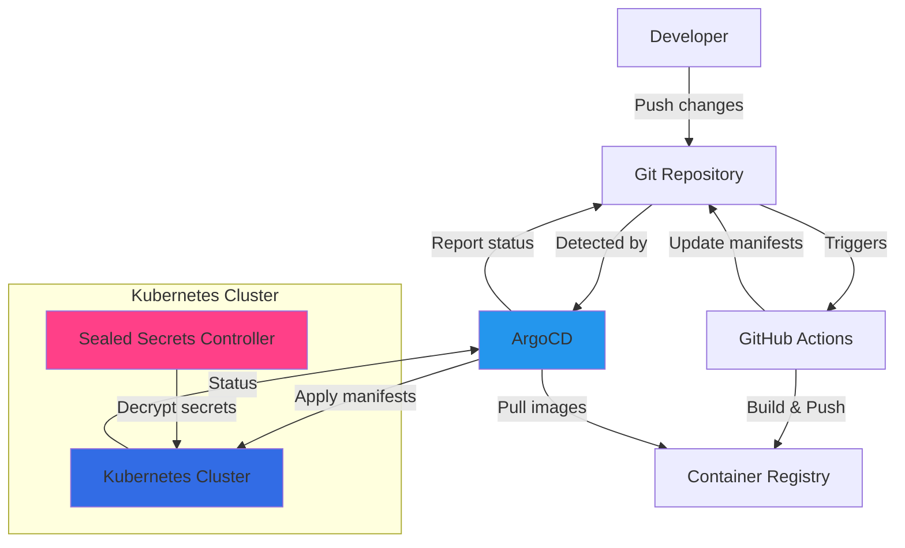

# Task Management Kubernetes Configuration

This repository contains the Kubernetes manifests for deploying the Task Management application. The application consists of a Flask backend, React frontend, and PostgreSQL database.

## Architecture

- **Backend**: Flask API service (`task-management`)
- **Frontend**: React application (`task-management-ui`)
- **Database**: PostgreSQL
- **Secret Management**: Bitnami Sealed Secrets
- **Continuous Deployment**: ArgoCD

## Directory Structure

```
.
├── base/                   # Base Kubernetes manifests
│   ├── 01-namespace.yaml
│   ├── 10-sealed-secrets.yaml
│   ├── 15-registry-secret.yaml
│   ├── 20-storage.yaml
│   ├── 30-postgres.yaml
│   ├── 40-backend.yaml
│   ├── 50-frontend.yaml
│   └── 60-ingress.yaml
├── overlays/
│   └── production/        # Production-specific configurations
│       └── kustomization.yaml
└── argocd/               # ArgoCD application manifests
    └── application.yaml
```

## Deployment Process

The deployment process is fully automated using ArgoCD, which watches this repository for changes and automatically syncs them to the cluster.

### Secret Management

Secrets are managed using Bitnami Sealed Secrets. To update a secret:

1. Create a new secret:
```bash
kubectl create secret generic my-secret --dry-run=client \
  --from-literal=MY_KEY=my-value \
  -n janneg -o yaml > temp-secret.yaml
```

2. Seal the secret:
```bash
kubeseal --format yaml --controller-namespace kube-system \
  --controller-name sealed-secrets < temp-secret.yaml > base/my-sealed-secret.yaml
```

3. Clean up and commit:
```bash
rm temp-secret.yaml
git add base/my-sealed-secret.yaml
git commit -m "feat: add new sealed secret"
git push origin main
```

### Version Management

The application uses semantic versioning for both backend and frontend services. Docker images are tagged with git tags and managed through GitHub Actions.

#### Creating New Releases

1. Backend Release:
```bash
cd task-management
git tag -a v1.1.0 -m "Description of changes"
git push origin v1.1.0
```

2. Frontend Release:
```bash
cd task-management-ui
git tag -a v1.1.0 -m "Description of changes"
git push origin v1.1.0
```

3. Update Kubernetes Manifests:
```bash
cd task-management-k8s
# Edit overlays/production/kustomization.yaml with new versions:
# images:
#   - name: ghcr.io/jannegpriv/task-management
#     newTag: v1.1.0
#   - name: ghcr.io/jannegpriv/task-management-ui
#     newTag: v1.1.0

git commit -am "feat: upgrade to v1.1.0"
git push origin main
```

ArgoCD will automatically detect these changes and update the deployments.

### Continuous Deployment

Below is a visualization of our continuous deployment workflow:



ArgoCD is configured to:
- Automatically sync changes from this repository
- Prune resources that are no longer in Git
- Self-heal if cluster state differs from Git state
- Create namespaces as needed

The ArgoCD application manifest is located in `argocd/application.yaml`.

## Backup System

The application includes an automated backup system for the PostgreSQL database using a Kubernetes CronJob.

### Backup Schedule and Configuration

- **Schedule**: Daily at 1 AM (UTC)
- **Retention**: Keeps last 3 successful backups and 1 failed backup
- **Concurrency**: Forbids overlapping backup jobs
- **Image**: `ghcr.io/jannegpriv/task-management-k8s-backup:1.0.3-backup`

### Backup Storage

Backups are stored in Backblaze B2 cloud storage. The following secrets are required:
- `b2-credentials` secret containing:
  - `B2_APPLICATION_KEY_ID`
  - `B2_APPLICATION_KEY`
  - `B2_BUCKET_NAME`

### Monitoring Backups

To check the status of backup jobs:
```bash
# View recent backup jobs
kubectl get cronjobs -n janneg
kubectl get jobs -n janneg

# View logs from the latest backup
kubectl get pods -n janneg -l job-name=db-backup -o name | xargs kubectl logs -n janneg

# View backup history
kubectl get events -n janneg --field-selector involvedObject.name=db-backup
```

### Troubleshooting Failed Backups

1. Check the logs of the failed backup job:
   ```bash
   kubectl get pods -n janneg -l job-name=db-backup -o name | xargs kubectl logs -n janneg
   ```

2. Verify the secrets are correctly configured:
   ```bash
   kubectl get secret b2-credentials -n janneg -o yaml
   kubectl get secret postgres-secrets -n janneg -o yaml
   ```

3. Manual backup trigger:
   ```bash
   kubectl create job --from=cronjob/db-backup manual-backup-$(date +%s) -n janneg
   ```

## Local Development

For local development of the services, refer to:
- Backend: [task-management](https://github.com/jannegpriv/task-management)
- Frontend: [task-management-ui](https://github.com/jannegpriv/task-management-ui)

## Monitoring and Troubleshooting

To check the status of your deployments:
```bash
kubectl get all -n janneg
```

To view ArgoCD sync status:
```bash
kubectl get application -n argocd task-management
```

To view sealed secrets:
```bash
kubectl get sealedsecrets -n janneg
